# Docker Learning Series

## Day 1 - Introduction to Cloud Computing and AWS

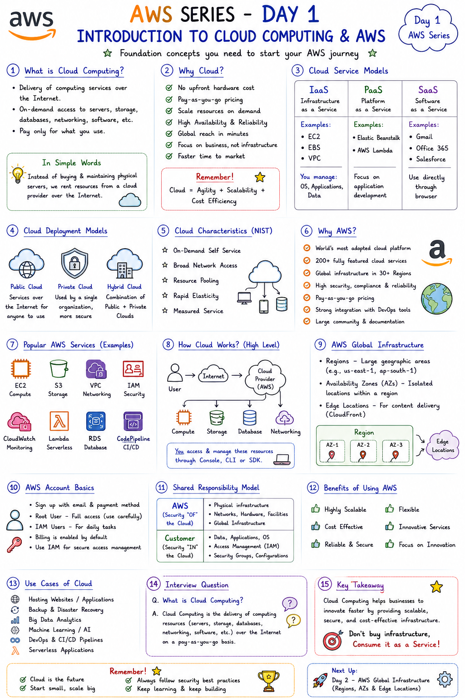

---

## Day 2 - AWS Global Infrastrture

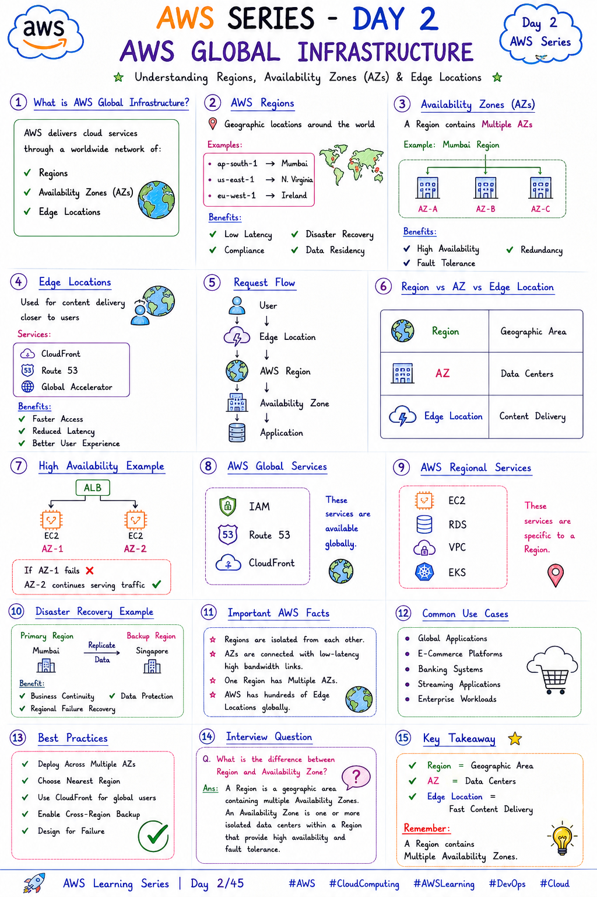

---
## Day 3 - AWS IAM(Identity and Access Management)

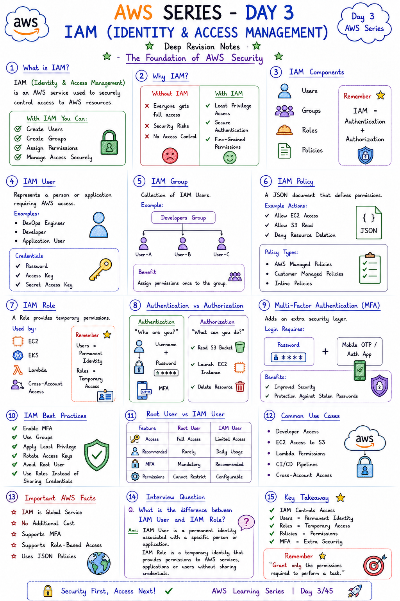

---
## Day 4 - AWS Billing and Pricing

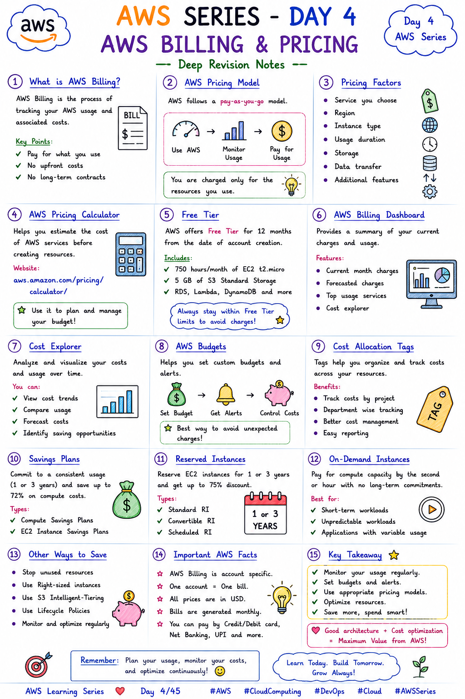

---
## Day 5 - Amazon EC2(Elastic Cloud Compute)

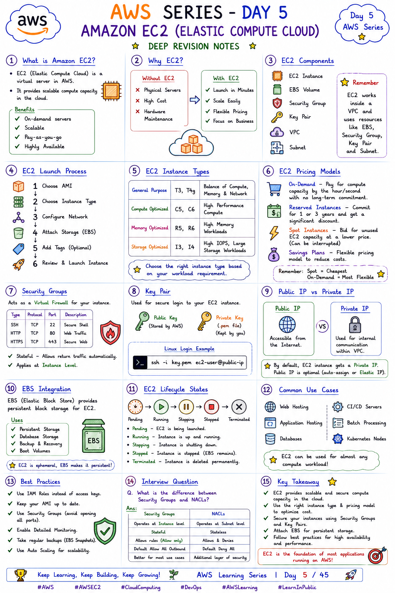

---
## Day 6 - Amazon EBS(Elastic Block Store)

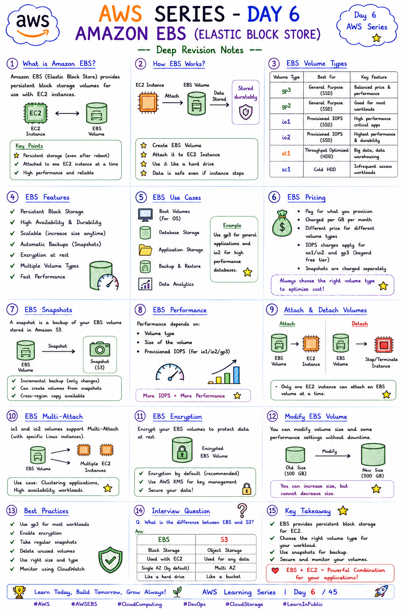

---
## Day 7 - Amazon IAM(Indentity and Access Management)

---

## Day 8 - Amazon S3(Simple Storage Cloud)

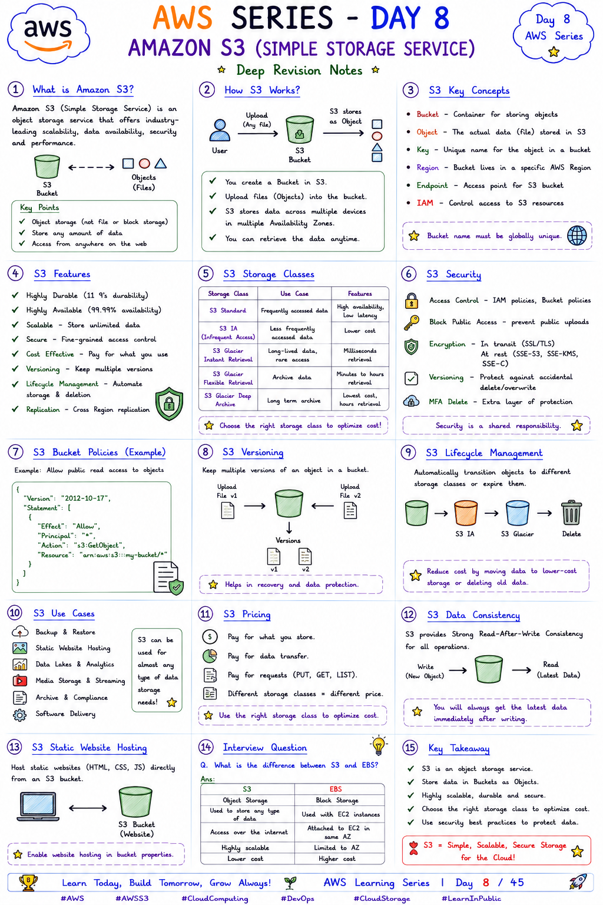

---

## Day 9 - Amazon S3 Storage Classes

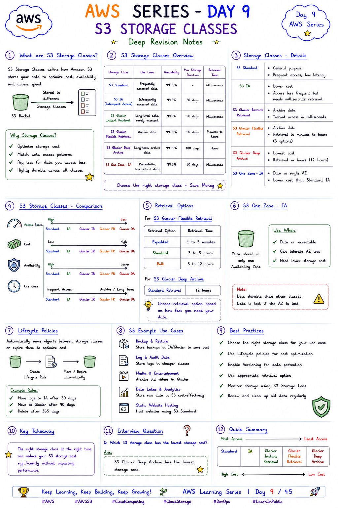

---
## Day 10 - AMAZON CLOUDFRONT

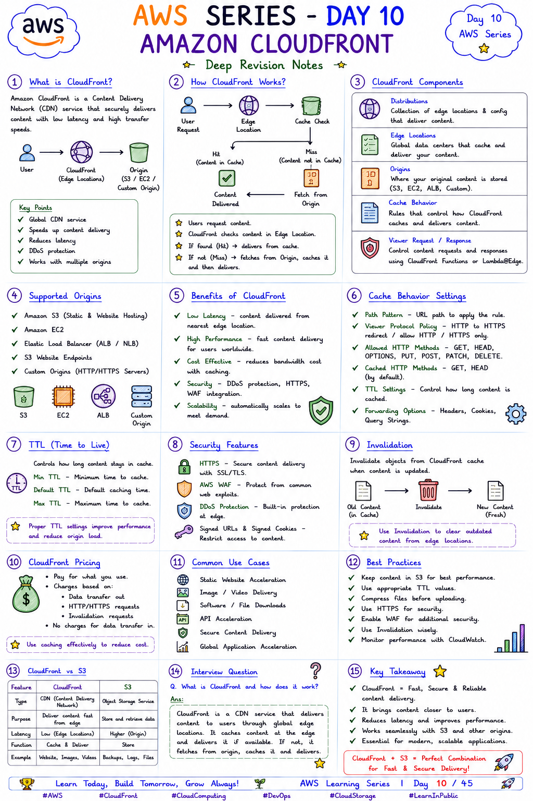

---
## Day 11 - AWS Shared Responsibility Model

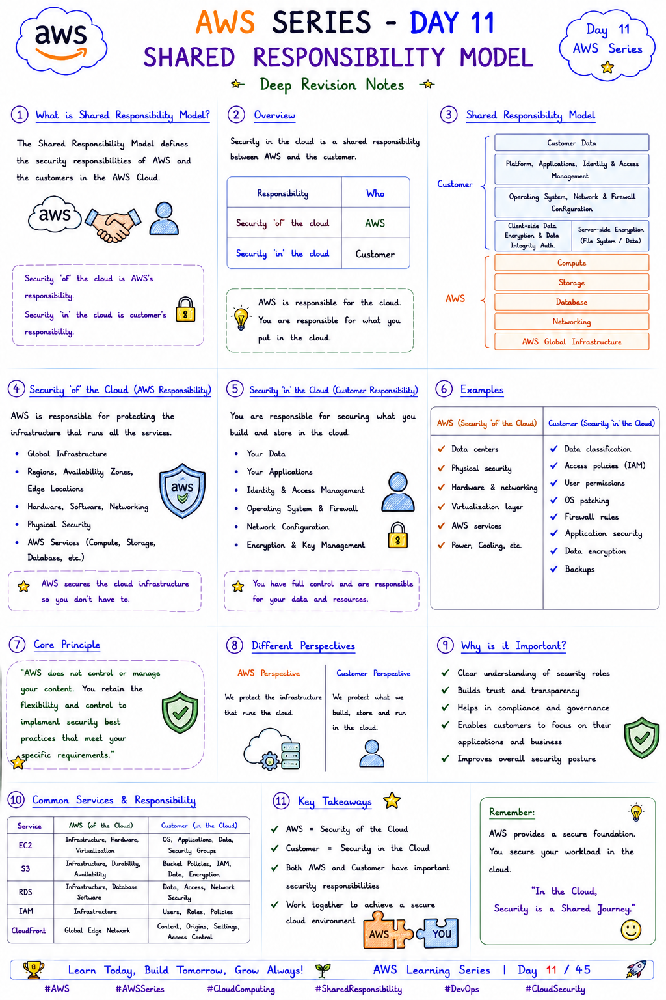

---

## Day 12 - AWS Organisations

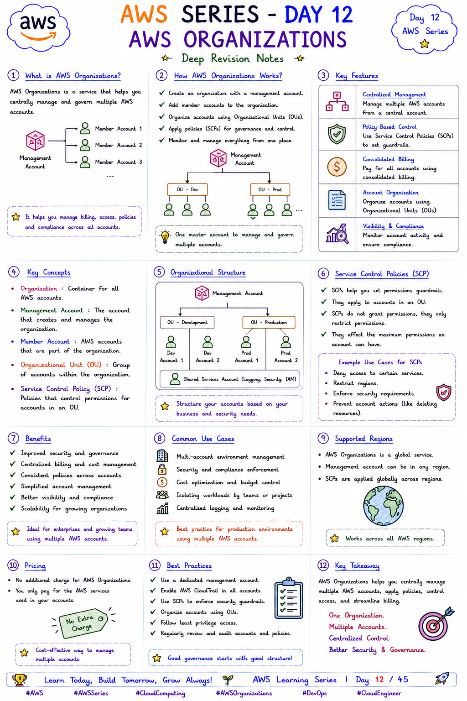

---
## Day 13 - AWS Support Plans

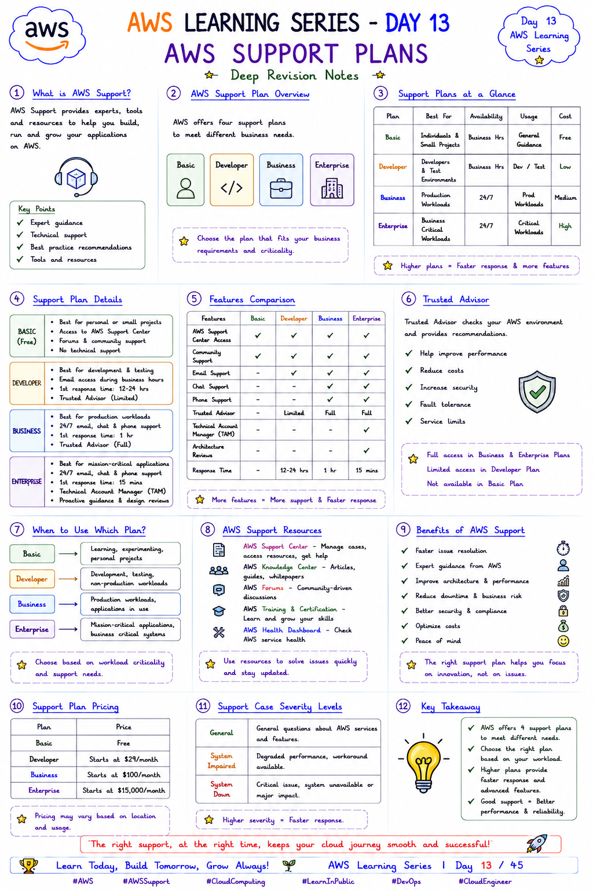

---
## Day 14 - AWS CLI

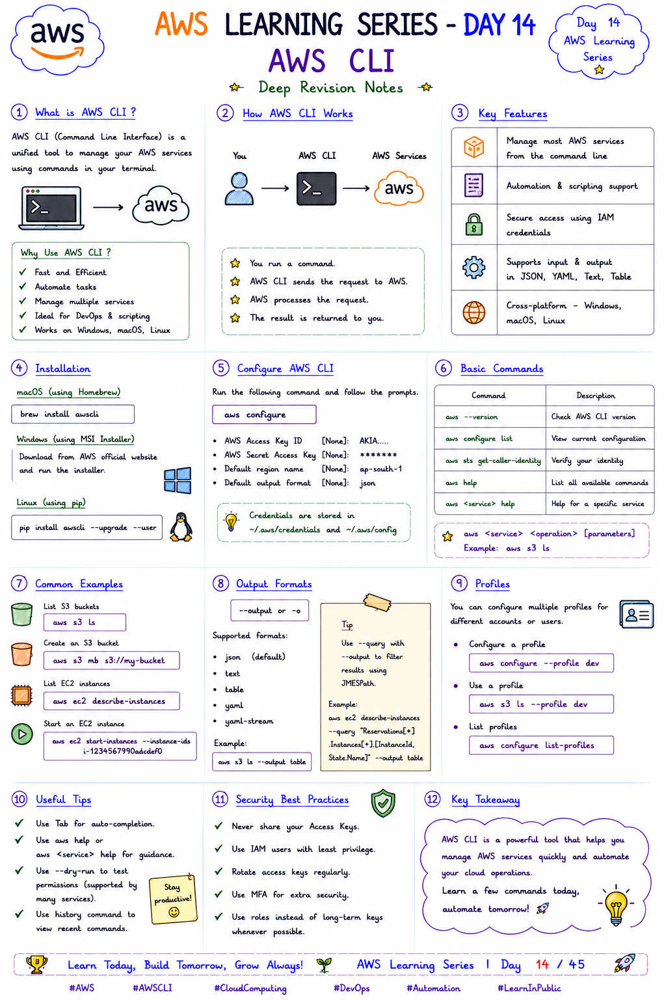

---

## Day 15 - AWS Well Architected Framework

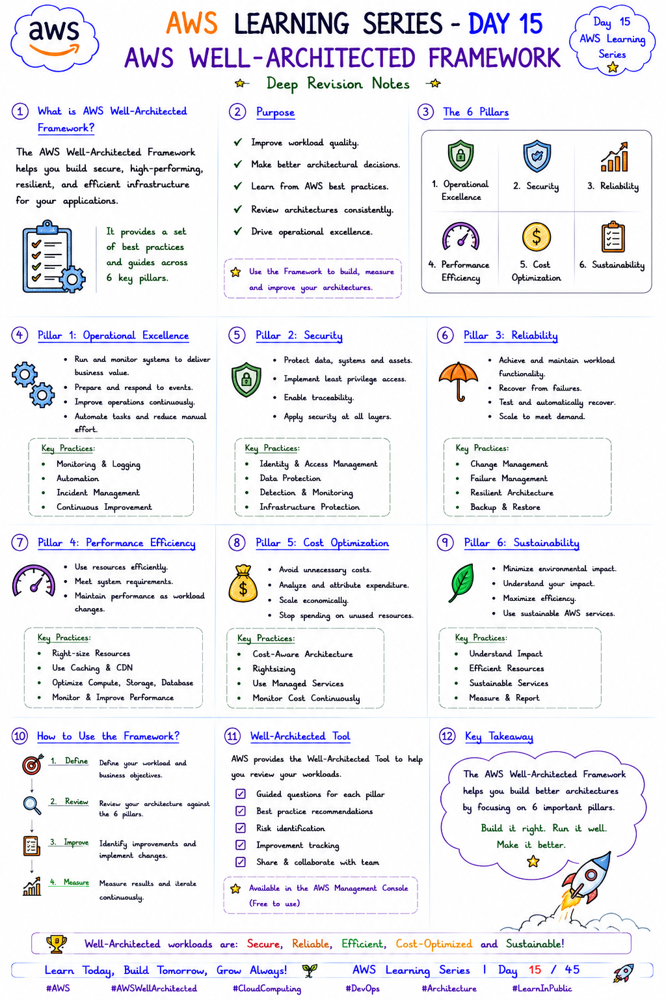

---

---
------
